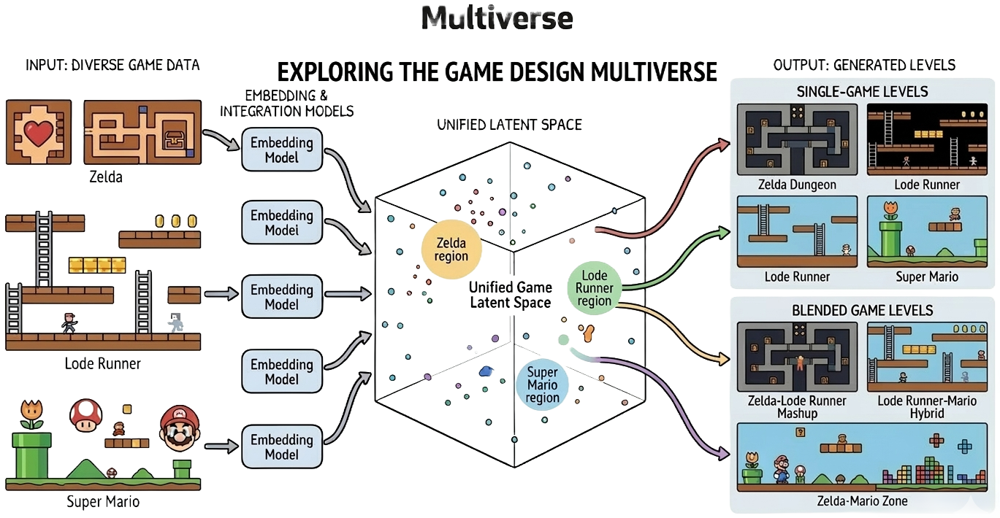
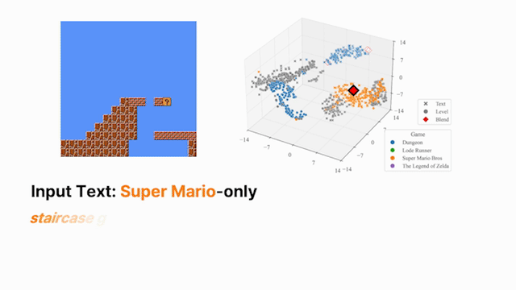
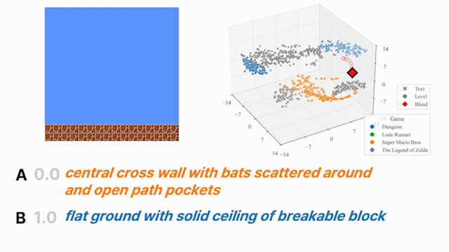
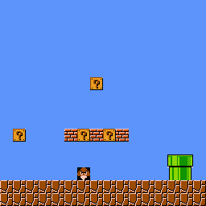
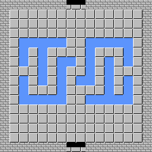
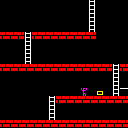
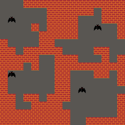

# Multiverse: Language-Conditioned Multi-Game Level Generator



## 🌟 Overview

> **Multiverse** is a **language-conditioned multi-game level generator** that enables both **multi-game level generation** and **cross-game level blending** through textual specifications.

Key highlights:
- 🎮 **Multi-game generation** — a single model covers multiple game domains
- 🔀 **Cross-game level blending** — smoothly interpolate between games via latent space
- 📝 **Language-guided control** — use text prompts to specify structural characteristics
- 🔗 **Shared latent space** — aligns textual instructions and level structures across games
- ✨ **Zero-shot compositional generation** — generate novel levels from compositional text prompts

Unlike prior text-to-level generators limited to a single game domain, Multiverse learns a **shared representation** that captures structural relationships across game domains, enabling controllable blending through latent interpolation.

| Compositional Text Blending | Embedding Interpolation Blending |
|:---:|:---:|
|  |  |

---

## 📦 Dataset

**5,576** annotated levels from human-authored game levels, collected from [VGLC](https://github.com/TheVGLC/TheVGLC) and [PCGRL](https://github.com/amidos2006/gym-pcgrl) environments.

| | 🍄 Super Mario Bros | 🗡️ The Legend of Zelda | 🏃 Lode Runner | 🏰 Dungeon |
|:---:|:---:|:---:|:---:|:---:|
| **Level** |  |  |  |  |
| **Instruction** | flat ground with pipe right and question blocks above center | spiral wall corridors around central floor with water pockets | ground platforms top and mid ladders left and center rope top gold right | scattered walls forming winding paths with bats in open areas |
| **Annotations** | 1,240 | 1,836 | 1,200 | 1,300 |

The dataset includes the original instructions ([`annotation.csv`](./instruct/annotation.csv)), a generalized version ([`generalized_annotation.csv`](./instruct/generalized_annotation.csv)), and a blended version combining instructions from two different games ([`blended_instruction.csv`](./instruct/blended_instruction.csv)).

To set up the dataset:

```bash
bash setup_dataset.sh
```


---

## 🛠️ Environment Setup

### 🐳 Build Docker Image

```bash
docker build -t multigame .
```

---

## 🚀 How to Run

### 🐳 Using Docker

The `run_docker.sh` script automatically finds and allocates an available GPU.  
Container names follow the format: `multigame_gpu{GPU_NUMBER}_{DATETIME}`.

#### Basic Usage

```bash
./run_docker.sh <command> [args...]
```

#### 🔑 Weights & Biases Setup

Create a `.env` file in the root directory:
```
WANDB_API_KEY=your_wandb_api_key
```

---

## 🏋️ Training

#### 🌐 Multiverse (Full Model)

Trains with the game-general loss (`gen`). Runs over seeds 0–9.

```bash
./run_docker.sh python train.py gen_threshold=0.3 loss_weights.base=0.0 loss_weights.gen=1.0 tsne_interval=200 render_interval=200 vit_eval_freq=200
```

#### 🔩 Single-positive Contrastive Learning (Baseline)

Trains with the base loss only. Runs over seeds 0–9.

```bash
./run_docker.sh python train.py overwrite=true loss_weights.base=1.0 loss_weights.base=0.0 tsne_interval=200 render_interval=200 vit_eval_freq=200
```


#### 📝 Text-Blend Evaluation

Evaluates cross-game level blending guided by compositional text prompts using a trained checkpoint.
```bash
./run_docker.sh python eval_textblend.py seed=0 \
  checkpoint_path="saves/e2e_exp-def_clipdr-0.1_cliptemp-0.14_gen-1.0_s-0/epoch_2000/checkpoints/checkpoint_epoch_2000.pt" \
  checkpoint_epoch=2000
```

---

## 📄 License

This project is licensed under the [MIT License](LICENSE).

